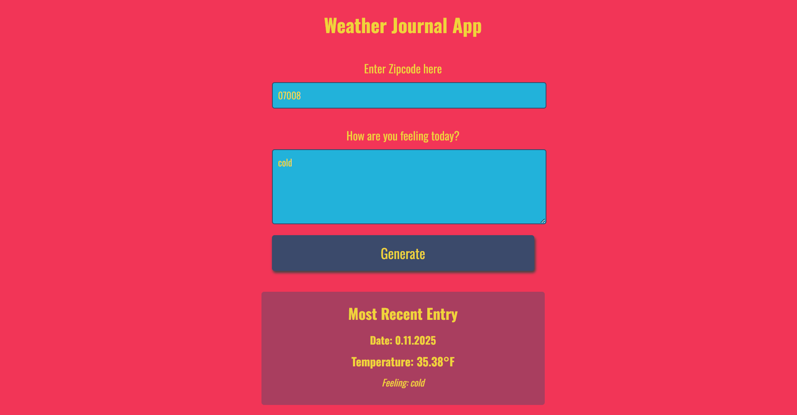

# Weather Journal App

## Overview

The **Weather Journal App** is a web application built as the third project in the **Udacity Frontend Web Developer Nanodegree**. This project focuses on creating an asynchronous web app that uses a Web API (OpenWeatherMap) to fetch weather data based on a user's zip code and allows users to input their feelings. The app dynamically updates the UI to reflect the fetched weather data and the user's input.

## Features

- Fetches weather data based on a user's zip code.
- Allows users to enter their feelings and store them.
- Dynamically updates the UI with the weather information and user input.
- Displays the most recent entry with temperature, date, and feelings.

## Technologies Used

- HTML5
- CSS3
- JavaScript (ES6+)
- Fetch API (for asynchronous data fetching)
- Express.js (for the backend server)
- OpenWeatherMap API (for weather data)

## Instructions

1. **Clone the repository**:

   ```sh
   git clone https://github.com/THEPEACEMAKER/weather-journal-app
   ```

2. **Install dependencies**:
   In the project directory, run:

   ```sh
   npm install
   ```

3. **Run the app**:
   Start the server by running:

   ```sh
   npm start
   ```

4. **Open the app**:
   Visit `http://localhost:3000` in your browser.

5. **Test the app**:
   Enter a valid zip code and your feelings to see the dynamic UI updates with weather information.

## How It Works

- The user inputs their zip code and feelings into the form.
- The app fetches the weather data from the OpenWeatherMap API using the provided zip code.
- The weather data and the user's feelings are sent to the server and stored.
- The UI is updated with the most recent entry, including the date, temperature, and user feelings.

## Screenshots


